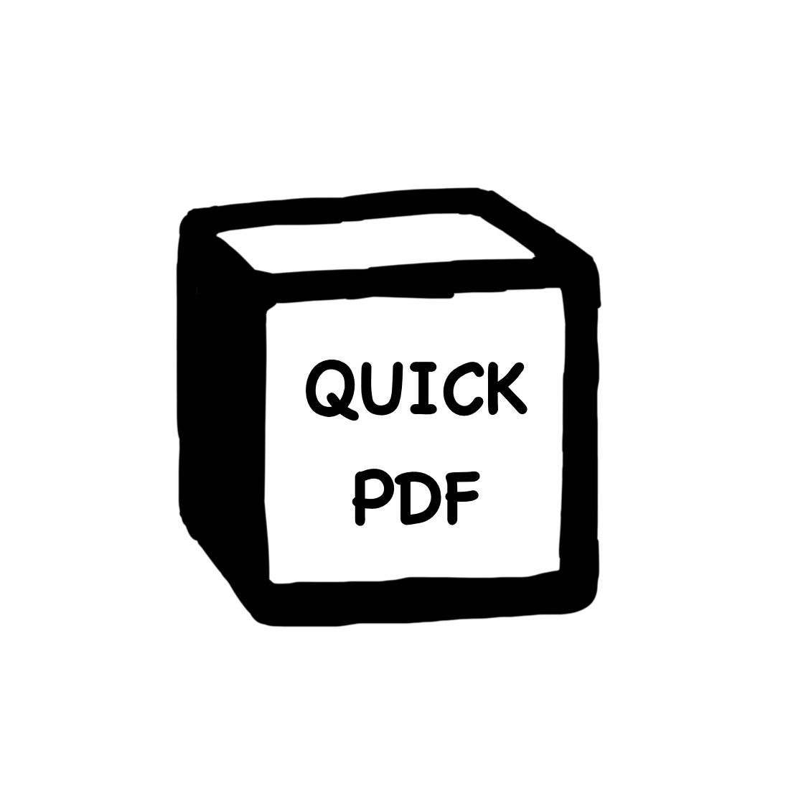

[](https://developer.mozilla.org/en-US/docs/Web/JavaScript)
[](https://developer.mozilla.org/en-US/docs/Web/HTML)
[](https://developer.mozilla.org/en-US/docs/Web/CSS)
[](https://developer.chrome.com/docs/extensions/)

# Notion PDF Exporter
Notion PDF Exporter는 자신의 Notion 페이지를 한 번의 클릭으로 PDF 파일을 내보낼 수 있도록 하는 크롬 확장 프로그램입니다.

<p align='center'>
  
</p>
<p align='center'>
  
  
</p>


<br>


<p align='center'>
  
</p>

## 파일 구조

- **manifest.json:**  
  확장 프로그램의 기본 설정, 이름, 버전, 권한 및 콘텐츠 스크립트 등 주요 정보를 포함합니다.  

- **popup.html:**  
  확장 프로그램의 팝업 인터페이스를 정의합니다. 로고 이미지와 PDF 내보내기 버튼이 포함되어 있습니다.  

- **popup.js:**  
  팝업 인터페이스와 관련된 동작(예: 버튼 클릭 시 이벤트 처리)을 구현합니다.

- **content.js:**  
  Notion 페이지에서 동작하는 스크립트로, PDF 생성과 관련된 기능을 담당합니다.


### ver 1.1
---

- 버그 
  - Notion PDF 내보내기 형식이 고정되는 문제

  - 사용자가 PDF 대신 다른 내보내기 형식(HTML, Markdown 등)을 마지막으로 사용한 경우 오류 발생을 확인 (“내보내기 형식”이 자동으로 PDF로 변환되지 않음)

- 해결 방법
  - “내보내기 형식” 드롭다운(현재 포맷 표기 버튼)을 먼저 클릭하여 실제 목록이 열리게 함
  - 목록에서 role="menuitem" 중 PDF 텍스트를 가진 요소를 찾아 클릭

- 적용 코드 요약
  ```javascript
  const formatButton = Array.from(document.querySelectorAll('.notion-dialog [role="button"]'))
    .find(el => ["Markdown & CSV", "HTML", "PDF"].includes(el.textContent.trim()));
  ```